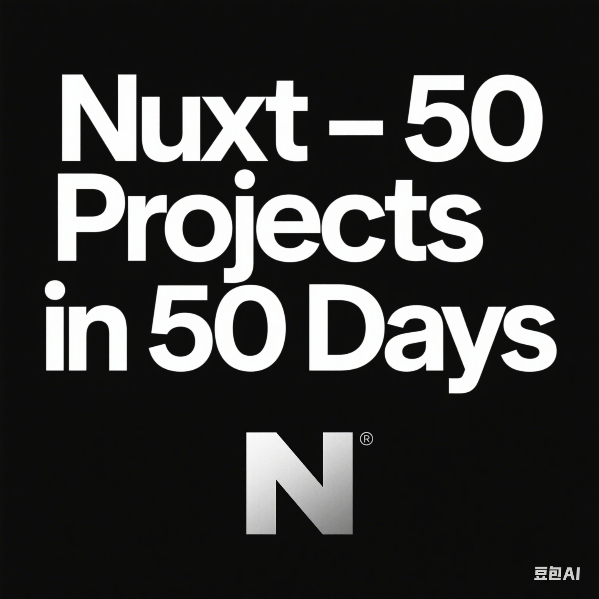

<!-- PROJECT LOGO -->
 

<h1 align="center">Nuxt - 50 Projects in 50 Days</h1>

  

    使用 Nuxt 工程基于 Vue 实现 50 个页面效果
     
    <a href="https://github.com/bradtraversy/50projects50days"><strong>源项目</strong></a>
  

## 目录
| # | Project                                       | Demo     |
|---|-----------------------------------------------|----------|
| 1 | [Expanding Cards]() | [Live]() |