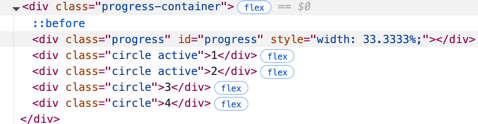
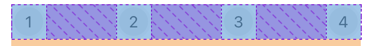
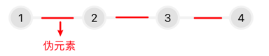
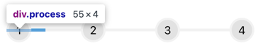
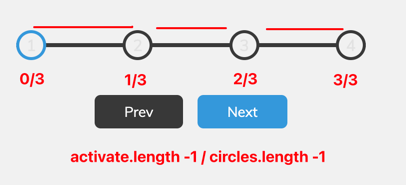

# 效果名称
效果说明：过程进度效果。示意如下：


**实现原理：**

- **整体**结构组织及逻辑实现：
  - 截图所示：主要元素有一个进度条容器（后续简称为容器），包含一个进度条（process），以及几个步骤（circle）。
  - 
  - 容器：使用一个 `flex` 布局，在一个指定的宽度中，使用水平垂直居中对齐`justify-content: center; align-items: center;`，将 circle 元素水平居中。
  - 
  - 伪元素：容器的伪元素，使用`:before`实现进度条未激活的背景样式，从容器的左边开始绘制，使用了一个伪元素经典居中方案：`absolute + top-50% + translateY(-50%)`的方案，使进度条背景在容器居中位置，`index:-1`不遮盖 circle。
  - 
  - 实际进度条：使用和伪元素相同的样式，通过变化`width`的方式实现视觉上进度条的加载。
  - 
  - 其它 1 ：使用Js维护一个索引 index，index 表示当前到第几步， `小于等于 (<=)` index 的 circle 都需要加上 `active`，改变边框样式
  - 其它 2 ：实际进度条的宽度增长，需要计算一下，计算方式也比较简单，推导一下，进度条一共要走 `n-1`次，`n`是节点的数量，所以分母就是`n-1`，分子的话（默认选中一个）初始是`0`，那么可以表示为`activate - 1`
  - 

**原生Js详解：**

第一步：初始化状态
```js
let currentActive = 0
// 获取所有步骤圆点
const circles = document.querySelectorAll('.circle')
// 获取具体的进度条 id="progress"
const progress = document.getElementById('progress')
```

第二步：给按钮添加点击事件，主要是维护 `currentActive`的状态
```js
// 获取上一个步骤按钮
const prev = document.getElementById('prev')
// 获取下一个步骤按钮
const next = document.getElementById('next')

// 为下一个步骤按钮添加点击事件监听器
next.addEventListener('click', () => {
    // 更新当前激活的步骤
    currentActive++

    // 如果当前激活的步骤超出总步骤数，则限制为最后一个步骤
    if(currentActive >= circles.length) {
        currentActive = circles.length
    }

    // 更新进度条和步骤
    update()
})
```

第三步：更新进度条和步骤
```js
function update(){
    // 1. 更新circle border样式
    // 遍历所有步骤圆点
    circles.forEach((circle, idx) => {
        // 如果当前索引小于当前激活的步骤，则添加active样式
        if(idx <= currentActive) {
            circle.classList.add('active')
        } else {
            // 否则移除active样式
            circle.classList.remove('active')
        }
    })

  // 2. 更新进度条宽度
  // 分子
  const activeCircles = document.querySelectorAll('.active')
  // 计算宽度，通过拼接的方式
  progress.style.width = (activeCircles.length - 1) / (circles.length - 1) * 100 + '%'
}
```
核心动画 Css - 伪元素、translate

1. 伪元素：`::before`是伪元素其中一种，它将成为匹配选中的元素的第一个子元素。
> https://developer.mozilla.org/zh-CN/docs/Web/CSS/::before

2. translate：属性可以接受一个、两个或三个值，分别表示沿X轴、Y轴和Z轴的平移（移动元素的位置）。

